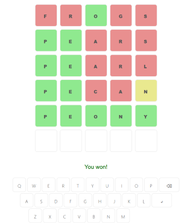

Wordle Clone in Elm
===================

A very basic clone of the game [Wordle](https://www.nytimes.com/games/wordle/index.html), which I wrote as a fun way to learn some [Elm](https://elm-lang.org/). It doesn't connect to a backend and only has a limited number of words to choose from.

 

Build
-----

```
npm install
npx elm make src/Main.elm --output=main.js
```

Run
---

Open `index.html` in the browser.
